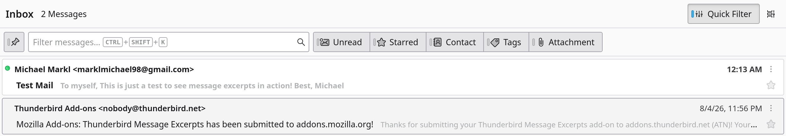
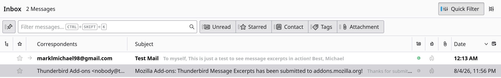

# Message Excerpts for Thunderbird

An extension for Thunderbird that displays message excerpts directly in the message list after the subject line.

|                   Cards View                    |
| :---------------------------------------------: |
|  |

|                    Table View                    |
| :----------------------------------------------: |
|  |

## Features

- Shows a snippet of the email body directly next to the subject in the message list view.
- Helps to quickly grasp the content of an email without opening it.
- Works both with Cards View and Table View.

## Installing

Currently, this add-on can only manually installed:

1.  Download the `addon.xpi` attached to the latest GitHub release
2.  In Thunderbird, go to `Add-ons and Themes`, `Extensions`
3.  Click on the gear icon button next to `Manage your extensions` and select `Install Add-on from file...`.
4.  Select the downloaded `addon.xpi`.


As Thunderbird [disallows](https://thunderbird.topicbox.com/groups/addons/T6ff545fb6d479da5/temporary-pause-on-new-experiment-api-add-on-reviews) new submissions of add-ons that use Experiment APIs.
Since this extension heavily relies on Experiment APIs, it is not expected to be listed on the official Thunderbird extension gallery in the near future.


## Compatibility

- Thunderbird 128 - 153

Tested versions:

- Thunderbird 153

## Building

To build the extension, simply run the build script:

```bash
./build.sh
```

This will generate the icons as png and create an `addon.xpi` file which can be loaded as a temporary add-on or installed in Thunderbird.

## License

This work is licensed under the MPL 2.0. A copy of this license is included in the [LICENSE](LICENSE) file.

## AI Disclosure

This add-on was created with the assistance of AI tools (Gemini 3.1 Pro).

All code was thoroughly reviewed, and significantly polished by me before publishing.
